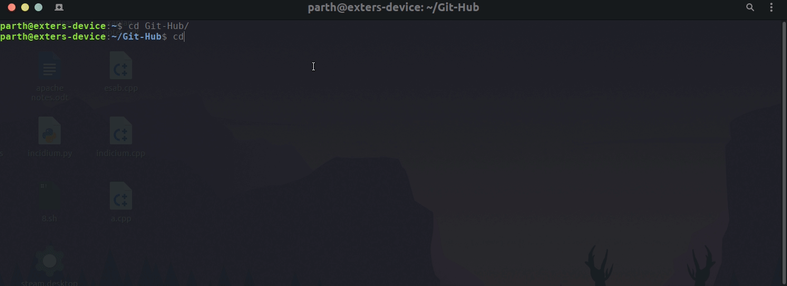

<p align=center>

</p>


<br>

> This site aggregates news articles from various sites and displays them in a single place. It is made using Python3 and with various Libraries.

<br>


[]()


[]()

---

## Table of Contents

> If your `README` has a lot of info, section headers might be nice.

- [Built with](#built-with)
- [Installation](#installation)
- [Contributing](#contributing)
  


---

## Built With

- Beautiful Soup
- Django
- Requests Module
- Wordcloud
- Matplotlib

---

## Installation

<br>

### Clone

- Clone this repo to your local machine using `https://github.com/Exter-dg/News-Aggregator-App`

### Setup

- Make sure, all the required packages are installed first.


#### Linux


```shell
$ cd NewsAggregator
$ python manage.py runserver
```

>If multiple versions of Python are installed, make sure to use pythonV3+.
```shell
$ cd NewsAggregator
$ python3 manage.py runserver
```

#### Windows

```shell
$ cd NewsAggregator
$ python manage.py runserver
```

[]()

---


## Contributing

> To get started...

### Step 1

- **Option 1**
    - 🍴 Fork this repo!

- **Option 2**
    - 👯 Clone this repo to your local machine using `https://github.com/Exter-dg/News-Aggregator-App`

### Step 2

- **HACK AWAY!** 🔨🔨🔨

### Step 3

- 🔃 Create a new pull request

---


